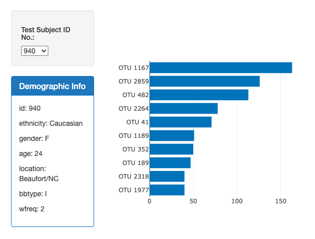
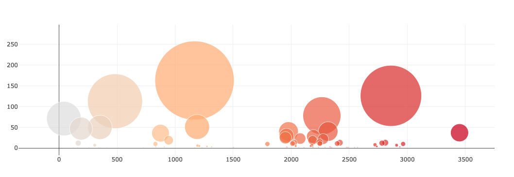

# belly-button-biodiversity-dashboard

This repository utilizes Plotly to  build an interactive dashboard to explore the Belly Button Biodiversity dataset, which catalogs the microbes that colonize human navels.

The dataset reveals that a small handful of microbial species (also called operational taxonomic units, or OTUs, in the study) were present in more than 70% of people, while the rest were relatively rare.

The app.js file uses the D3 library to read in the data from samples.json.

It then creates a dropdown menu for a user to select the ID of a human participant in the study.

The html page will then display three visualizations of the data associated with that study participant.

The first is a horizontal bar chart displaying the top ten OTU populations found in that participants belly button.

The second is a panel that displays the participants demographic metadata.

The third is a bubble chart with the size of the bubbles relative to the population of each OTU found in that individual.

A user can select different study participants in the dropdown menu and each visualization will automatically be updated to display data for the selected participant.
